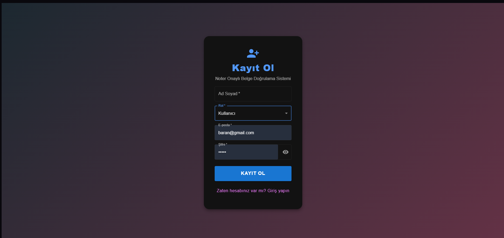
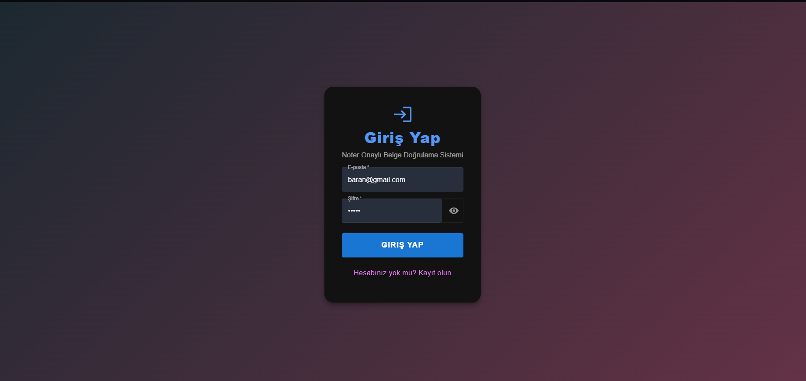
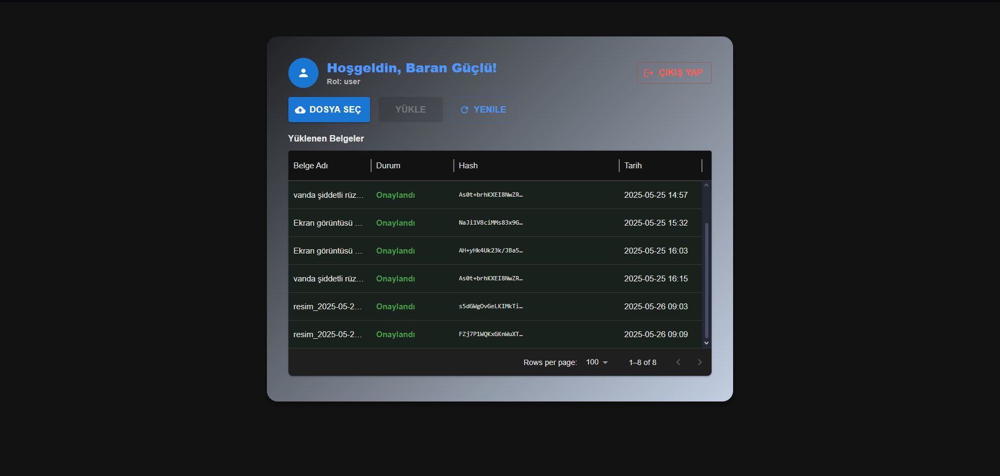
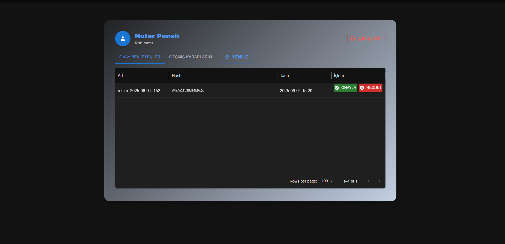
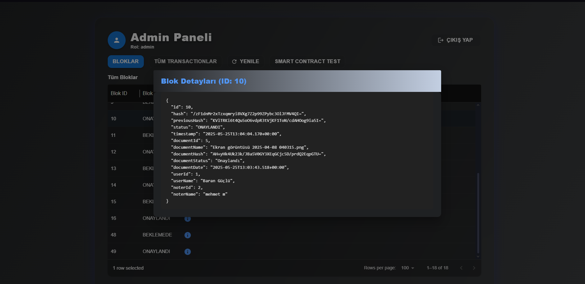
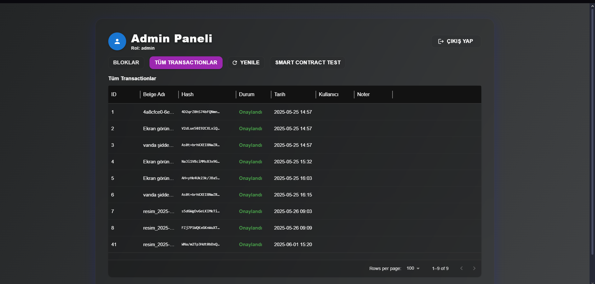

# Blockchain Tabanlı Belge Doğrulama Sistemi


## 📋 Proje Hakkında

Bu proje, noter onaylı belgelerin güvenli, şeffaf ve merkeziyetsiz bir şekilde doğrulanmasını sağlamak için blockchain teknolojisi temelli bir sistem sunar. Amaç; belge manipülasyonunu önlemek, işlemleri izlenebilir ve denetlenebilir kılmak, yetkisiz erişimi engellemek ve tüm süreci dijitalleştirerek hızlandırmaktır.

## 🚀 Özellikler

- **Belge Yükleme ve Onay Süreci**
  - Kullanıcılar belge yükler
  - Noterler, yüklenen belgeleri onaylar veya reddeder
  - Her onay/red işlemi, zincire yeni bir blok olarak eklenir

- **Blockchain Altyapısı**
  - Her blok, bir önceki bloğun hash'ini referans alır
  - Blok hash'i, tüm blok içeriğinden üretilir
  - Zincir, dokümandan bağımsız, global ve kopmayan bir yapıdadır

- **Smart Contract Mantığı**
  - Java tabanlı SmartContractService ile zincir bütünlüğü
  - Merkezi yetki kontrolleri
  - Sadece noter rolündeki kullanıcılar onay/red işlemi yapabilir

- **Admin Paneli**
  - Tüm bloklar ve transactionlar izlenebilir
  - Smart Contract testleri yapılabilir
  - Sistem yönetimi ve izleme

- **Modern Arayüz**
  - Material UI ile responsive tasarım
  - Animasyonlu geçişler
  - Kullanıcı dostu paneller

## 🤖 Yapay Zeka Özellikleri

### Belge Analizi ve İşleme
- **OCR ile Belge İçeriği Çıkarma**
  - Otomatik metin tanıma
  - Belge içeriğinin dijitalleştirilmesi
  - Çoklu dil desteği

- **Akıllı Belge Sınıflandırma**
  - Belge türlerinin otomatik tespiti
  - Belge kategorilerinin yapay zeka ile belirlenmesi
  - Sınıflandırma doğruluk oranı optimizasyonu

- **Belge Önceliklendirme ve Risk Skorlaması**
  - Belge önem derecesinin otomatik belirlenmesi
  - Risk skorlaması ve değerlendirmesi
  - Öncelik bazlı işlem sıralaması

### Akıllı Raporlama ve Analiz
- **İşlem Trendleri Analizi**
  - Belge işlem süreçlerinin analizi
  - Performans metriklerinin hesaplanması
  - Trend bazlı raporlama

- **Tahminleme ve Öngörü Analizi**
  - Gelecek dönem işlem tahminleri
  - Yük analizi öngörüleri
  - Kaynak planlama önerileri

### Teknik Altyapı
- **AI Model Entegrasyonu**
  - TensorFlow/PyTorch tabanlı modeller
  - Özel eğitilmiş sınıflandırma modelleri
  - OCR motoru entegrasyonu

- **Veri İşleme ve Analiz**
  - Gerçek zamanlı veri analizi
  - Batch işleme desteği
  - Ölçeklenebilir AI servisleri

## 🛠️ Teknoloji Yığını

- **Backend:** Java & Spring Boot
- **Frontend:** React & Material UI
- **Veritabanı:** PostgreSQL
- **Blockchain:** Özel Java implementasyonu
- **Yetkilendirme:** JWT tabanlı, rol kontrollü
- **Yapay Zeka:** TensorFlow/PyTorch, OCR, Özel AI Modelleri

## 🚀 Kurulum

### Ön Gereksinimler

- Docker Desktop
- Git

### Adımlar

1. **Projeyi Klonlama**
```bash
git clone [PROJE_REPO_URL]
cd [PROJE_KLASOR_ADI]
```

2. **Docker Servislerini Başlatma**
```bash
docker-compose up --build
```

3. **Veritabanı Kurulumu**
```bash
docker exec -i postgres psql -U postgres -d noterdb < admin-ekle.sql
```

### Servis Portları

- Frontend: http://localhost:3000
- User API: http://localhost:8081
- Noter API: http://localhost:8082
- Admin API: http://localhost:8083
- PostgreSQL: localhost:5432

## 👥 Kullanıcı Rolleri

### Kullanıcı
- Belge yükleme
- Belge durumu takibi
- Belge görüntüleme

### Noter
- Belge onaylama/reddetme
- Blockchain işlemleri
- Belge doğrulama

### Admin
- Sistem yönetimi
- Blockchain izleme
- Smart Contract testleri

## 🔒 Güvenlik Özellikleri

- Rol bazlı yetkilendirme
- JWT tabanlı kimlik doğrulama
- Blockchain ile değişmezlik
- Merkezi yetki kontrolü
- Detaylı hata yönetimi

## 📸 Ekran Görüntüleri









## 🛠️ Geliştirme

### Backend Yapısı

- **Block.java:** Blok yapısı ve hash üretimi
- **DocumentService.java:** Belge işlemleri yönetimi
- **SmartContractService.java:** Smart contract mantığı
- **DocumentController.java:** API endpoint'leri

### Frontend Yapısı

- **AdminPanel.js:** Admin işlemleri
- **UserPanel.js:** Kullanıcı işlemleri
- **NoterPanel.js:** Noter işlemleri
- **Login.js & Register.js:** Kimlik doğrulama

## 🔧 Sorun Giderme

1. **Servisler Başlatılamıyor**
```bash
docker-compose down
docker-compose up --build
```

2. **Veritabanı Bağlantı Hatası**
- PostgreSQL container'ının çalıştığından emin olun
- Veritabanı kimlik bilgilerini kontrol edin

3. **Port Çakışması**
- 3000, 8081, 8082, 8083 ve 5432 portlarının kullanılabilir olduğundan emin olun

## 📝 Lisans

Bu proje MIT altında lisanslanmıştır. Detaylar için `LICENSE` dosyasına bakın.

## 👥 Katkıda Bulunma

1. Fork'layın
2. Feature branch oluşturun (`git checkout -b feature/amazing-feature`)
3. Değişikliklerinizi commit edin (`git commit -m 'feat: Add amazing feature'`)
4. Branch'inizi push edin (`git push origin feature/amazing-feature`)
5. Pull Request oluşturun
